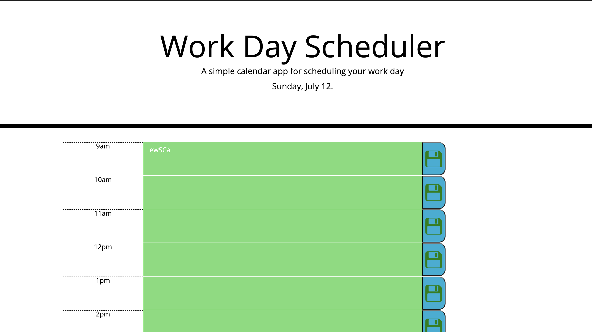

# Day Scheduler Planner Application
 
 * This application helps users plan their day from 9am to 5pm.
    The plans made are saved and can be modified anytime.

    * The Application uses colors to style the hours blocks 
     depening on the actual time and date.
      Gray means the hour block is in the past.
      Red means that the hour block is the current hour.
      Green means that the hour block is in the future.

    * HTML, CSS, JavaScript, JQuery.js and Moment.js were used 
     to render the final result.

# Application Link:  https://ahtiap.github.io/Day-planner/.
